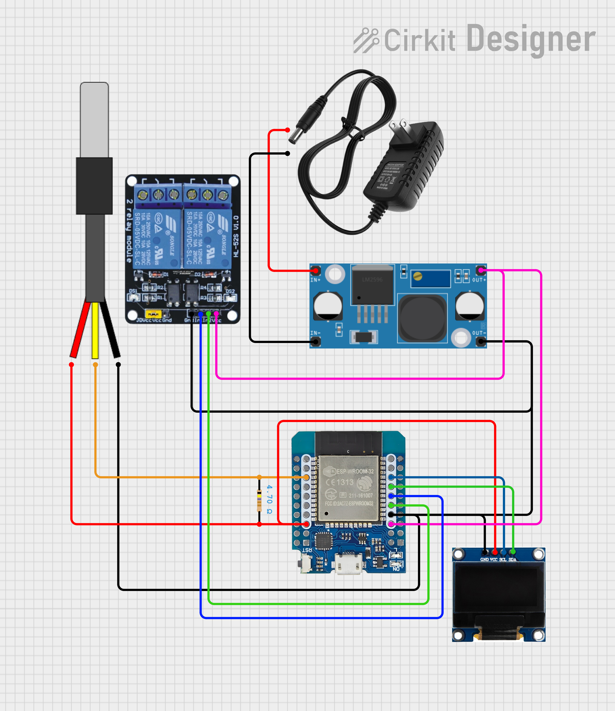

# ESP32 Cooling Controller

PlatformIO firmware for an ESP32-based cooling controller with a DS18B20
temperature probe, SSD1306 OLED display, relay outputs, persistent settings,
and an embedded web dashboard.

The controller is designed for a small Peltier cooling setup: it switches the
Peltier relay according to a target temperature and hysteresis band, keeps the
fan running during cooling, and supports a configurable fan run-on time after
the Peltier element turns off.

## Prerequisites

- Python 3 for PlatformIO scripts and the local dashboard development server.
- PlatformIO Core, or VS Code with the PlatformIO extension.
- An ESP32 board compatible with the `wemos_d1_mini32` PlatformIO environment.
- A USB cable with data support and, if required by your board, the matching USB
  serial driver.
- The project hardware: DS18B20 probe, SSD1306 OLED, relay module, and the
  DS18B20 pull-up resistor.

PlatformIO downloads the Arduino framework and declared libraries during the
first build.

## Features

- DS18B20 temperature measurement with non-blocking conversion timing.
- Peltier and fan relay control, including a short startup self-test.
- Hysteresis-based cooling logic:
  - cooling starts above `target + hysteresis`;
  - cooling stops once the temperature reaches `target`;
  - the fan can continue running for a configurable run-on period.
- Safety behavior for a disconnected DS18B20 sensor (`-127 C`): Peltier output
  is disabled.
- SSD1306 OLED status display with temperature, relay state, settings, timing,
  and network pages.
- Embedded web dashboard for live status, settings, and an automatic local demo
  scene when the board connection is unavailable.
- Persistent settings stored in ESP32 Preferences/NVS.
- ArduinoOTA firmware updates after the controller joins a station Wi-Fi
  network.
- Native Unity tests for domain logic and generated dashboard embedding.

## Hardware

| Component | ESP32 pin |
| --- | --- |
| SSD1306 SDA | GPIO 21 |
| SSD1306 SCL | GPIO 22 |
| DS18B20 data | GPIO 26 |
| Peltier relay IN1 | GPIO 17 |
| Fan relay IN2 | GPIO 16 |

The DS18B20 data line expects the usual pull-up resistor between data and VCC.
The relay module is configured as active-low (`LOW` = on, `HIGH` = off).

### Wiring Diagram



## Default Settings

| Setting | Default | Allowed range |
| --- | ---: | ---: |
| Target temperature | `5.0 C` | `-20.0 C` to `40.0 C` |
| Hysteresis | `0.1 C` | `0.1 C` to `10.0 C` |
| Measurement interval | `500 ms` | `250 ms` to `60000 ms` |
| Fan run-on time | `30000 ms` | `0 ms` to `600000 ms` |

Wi-Fi defaults:

| Setting | Value |
| --- | --- |
| Access point SSID | `CoolingController` |
| Access point password | `cooling123` |
| Web server port | `80` |
| OTA hostname | `cooling-controller` |

The access point is always started. Station mode can be configured from the
dashboard by saving a station SSID and password.

OTA defaults:

| Setting | Build flag |
| --- | --- |
| Enable OTA | `-DCOOLING_OTA_ENABLED=1` |
| Device hostname | `-DCOOLING_OTA_HOSTNAME=\"cooling-controller\"` |
| Plain password | `-DCOOLING_OTA_PASSWORD=\"\"` |
| MD5 password hash | `-DCOOLING_OTA_PASSWORD_HASH=\"\"` |

OTA has no password by default. Prefer setting `COOLING_OTA_PASSWORD_HASH` in a
local PlatformIO environment or private build command instead of committing a
secret.

## Project Structure

```text
src/
  main.cpp              Product entry point
  product/
    CoolingFirmware.*   Explicit product composition
lib/
  fw_app/           Shared feature application context
  fw_core/          Shared time, lifecycle, and debug helpers
  fw_esp32/         ESP32 clock, restart, and NVS adapters
  fw_network/       AP/STA lifecycle, reconnects, and scanning
  fw_web/           HTTP host, router, and JSON helpers
  fw_ota/           ArduinoOTA and HTTP firmware updates
  fw_telemetry/     Fixed-capacity history storage
  cooling_domain/   Platform-independent cooling state machine
  cooling_feature/  Cooling hardware, persistence, display, API, and feature
  blink_feature/    Reuse example with its own status application
web/          Editable dashboard HTML, CSS, and JavaScript sources
tools/        Build and local development helpers
test/         Unity tests
docs/         Project notes and media
```

New modules should be placed by responsibility. The `cooling_domain` library
must remain independent of Arduino and concrete hardware libraries so it stays
fully testable in the native environment.

`CoolingFirmware` owns the shared clock, settings backend, network, web, OTA,
restart, and telemetry services. It integrates cooling through one
`CoolingFeature`, which receives only the shared services exposed by
`AppContext`. Cooling-specific serialization and routes remain in `CoolingApi`.

Every library has a `library.json` manifest and exposes headers only from its
own `src/` directory. PlatformIO resolves the dependency graph from the product
composition, while `src/main.cpp` only delegates Arduino setup and loop calls.

The runtime composition is intentionally explicit:

```text
src/main.cpp
  -> CoolingFirmware (composition root)
       -> shared services: clock, settings, network, web, OTA, telemetry
       -> CoolingFeature
            -> cooling_domain (pure control rules)
            -> hardware, storage, OLED, and cooling HTTP API adapters
```

This keeps product wiring in one place, lets features reuse the same services,
and keeps control rules testable without an ESP32.

## Adding Your Own Functionality

Put new code in the narrowest layer that fits its responsibility:

- Add calculations, state machines, and validation that do not need Arduino to
  a platform-independent domain library such as `lib/cooling_domain/`.
- Add reusable ESP32 or infrastructure integration to a focused `fw_*` library.
- Add a product capability that coordinates hardware, persistence, APIs, or UI
  as its own `*_feature` library.
- Keep object construction and lifecycle ordering in the product composition,
  such as `CoolingFirmware`.

The following minimal example adds a periodic heartbeat feature with an HTTP
endpoint. First create `lib/heartbeat_feature/library.json` and declare only
the libraries used by its public API:

```json
{
  "name": "heartbeat_feature",
  "version": "1.0.0",
  "build": { "srcDir": "src" },
  "dependencies": {
    "fw_app": "*",
    "fw_core": "*",
    "fw_telemetry": "*",
    "fw_web": "*"
  }
}
```

Expose a small lifecycle interface from
`lib/heartbeat_feature/src/heartbeat_feature/HeartbeatFeature.h`:

```cpp
#pragma once

#include <stdint.h>
#include <WebServer.h>

#include "app/AppContext.h"
#include "web/ApiRouter.h"

class HeartbeatFeature {
public:
  void begin(AppContext &context);
  void registerApi(ApiRouter &router);
  void tick(uint32_t nowMs);

private:
  AppContext *context_ = nullptr;
  WebServer *server_ = nullptr;
  uint32_t lastBeatMs_ = 0;
  uint32_t beatCount_ = 0;
};
```

Implement it in `lib/heartbeat_feature/src/HeartbeatFeature.cpp`. Use the
injected clock and services instead of constructing platform dependencies in
the feature:

```cpp
#include "heartbeat_feature/HeartbeatFeature.h"

void HeartbeatFeature::begin(AppContext &context)
{
  context_ = &context;
  lastBeatMs_ = context.clock.nowMs();
  context.telemetry.registerSource("heartbeat");
}

void HeartbeatFeature::registerApi(ApiRouter &router)
{
  server_ = &router.server();
  router.get("/api/heartbeat", [this]() {
    String json = "{\"beatCount\":";
    json += beatCount_;
    json += "}";
    server_->send(200, "application/json", json);
  });
}

void HeartbeatFeature::tick(uint32_t nowMs)
{
  if (static_cast<uint32_t>(nowMs - lastBeatMs_) < 1000U) {
    return;
  }
  lastBeatMs_ = nowMs;
  ++beatCount_;
}
```

Finally, include `heartbeat_feature/HeartbeatFeature.h`, add a
`HeartbeatFeature heartbeat_;` member to `CoolingFirmware`, and connect it to
the existing lifecycle at these points:

```cpp
// CoolingFirmware::begin(), before network_.begin():
heartbeat_.begin(context_);

// CoolingFirmware::begin(), before web_.begin():
heartbeat_.registerApi(web_.router());

// CoolingFirmware::update(), using the existing nowMs value:
heartbeat_.tick(nowMs);
```

Register routes before `web_.begin()`, keep `tick()` non-blocking, and use
unsigned elapsed-time subtraction as shown so timers remain correct when
`millis()` wraps. If the feature has substantial pure logic, move that logic to
a separate domain library and add native Unity tests. For a complete reusable
product example, follow `lib/blink_feature/` and its
`examples/status_device/` composition.

## Web Dashboard

The editable dashboard is split into reusable modules under `web/core/` and
`web/system/`, while application-specific pages and scripts live under
`web/apps/`. During a PlatformIO build, `tools/embed_dashboard.py` reads the
selected application manifest, inlines its referenced CSS/JavaScript assets,
and regenerates that product's web page header.

Built-in routes:

| Route | Purpose |
| --- | --- |
| `/`, `/dashboard.html`, or `/apps/cooling/dashboard` | Main dashboard |
| `/api/status` | Live status JSON |
| `/api/history` | Compact in-memory temperature history JSON |
| `/api/history.csv` | Temperature history as CSV |
| `/api/settings` | Read or save controller settings |
| `/api/networks` | Scan nearby Wi-Fi networks and signal levels |
| `/api/firmware` | Upload a compiled firmware image and reboot |

`/api/dev` is also available for the local dashboard simulation tooling.

To add a web application:

1. Create `web/apps/example/manifest.json` with `id`, `title`, and an
   extensionless `entry` route.
2. Create the matching HTML file, such as
   `web/apps/example/dashboard.html` for an entry of
   `/apps/example/dashboard`.
3. Reference reusable `/core/*` and `/system/*` modules plus the application's
   own `/apps/example/*` assets from that page.

The manifest drives both embedded page generation and local route discovery.
The selected embedded application, and the first application in local
development, are also exposed through the compatibility aliases `/` and
`/dashboard.html`.

For local dashboard development without an ESP32:

```sh
python3 tools/web_dev_server.py
```

The dashboard is served at `http://127.0.0.1:8080/` by default. If the port is
busy, the helper tries the next available port unless `--no-port-fallback` is
used. The local API starts from the JSON contracts in `test/fixtures/api/` and
adds dynamic temperature/history values, so local development and contract
tests share the same response fields.

## Reuse Example

`lib/blink_feature/examples/status_device/` is an independent product that
reuses the shared clock, NVS settings backend, AP/STA networking, HTTP host,
OTA services, firmware upload, telemetry registry, and system dashboard
modules. It exposes its own blink status and settings APIs and has no cooling
dependency.

Build it from the repository root:

```sh
pio run -d lib/blink_feature/examples/status_device
```

## Build, Upload, and Monitor

```sh
pio run
pio run --target upload
pio device monitor
```

The default PlatformIO environment is `wemos_d1_mini32`.

## OTA Firmware Updates

Flash the firmware once over USB, open the dashboard access point, and save the
station Wi-Fi SSID/password. OTA starts only after the ESP32 connects to that
station network. The serial monitor prints `OTA service started` with the
hostname and station IP when updates are available.

Upload over Wi-Fi by hostname:

```sh
pio run -e wemos_d1_mini32_ota --target upload
```

Or upload by the station IP shown in the dashboard or serial monitor:

```sh
pio run -e wemos_d1_mini32_ota --target upload --upload-port 192.168.1.50
```

If ArduinoOTA cannot reach the device but the dashboard opens in a browser, use
the web fallback. Build the firmware with `pio run`, open Settings, choose
`.pio/build/wemos_d1_mini32/firmware.bin` in the Firmware section, and upload it.
The controller reboots after the HTTP upload completes.

To require an OTA password, add a private build flag such as
`-DCOOLING_OTA_PASSWORD_HASH=\"<md5-hash>\"` or
`-DCOOLING_OTA_PASSWORD=\"<password>\"`, and upload with a private
`upload_flags = --auth=<password>` setting. Disable OTA for a build with
`-DCOOLING_OTA_ENABLED=0`. The default ESP32 Arduino partition layout used by
this board already includes OTA app slots, so no custom partition table is
needed.

## Tests

Run the native test suite:

```sh
pio test -e native
```

The current tests cover the pure cooling state machine, fan run-on and timer
overflow behavior, disconnected-sensor safety, cooling/network sanitization,
fixed-capacity history retention, API response contracts, and generated
dashboard embedding. Shared clock/settings interfaces and telemetry
registration are also covered with native fakes.

## Notes

- Settings submitted through the dashboard are sanitized before use and before
  being stored.
- The OLED startup screen shows the access point IP and relay self-test state.
- If the DS18B20 reports the disconnected marker, the UI shows a sensor error
  and the Peltier relay remains off.
